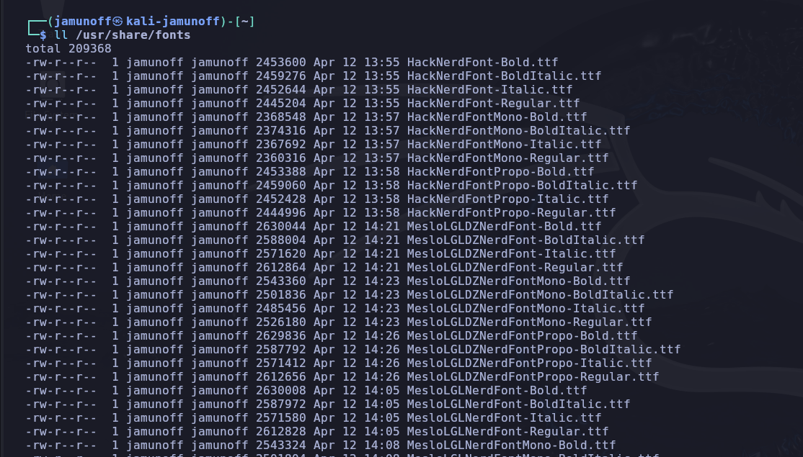
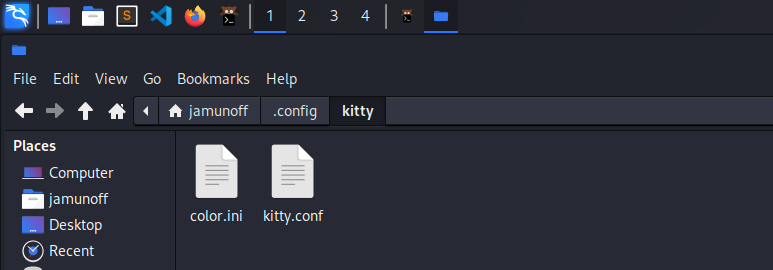

# Clase 1 - Introducción a la formación

Los objetivos de esta clase son:

* Iniciar y primeras impresiones de la máquina Linux.
* Copia de seguridad, (Snapshot), de la máquina virtual
* Personalización de Linux. Instalación de software adiccional.
* Lecturas/visionados previos recomendados.
* Modo de aprendizaje practicando. 
* Toma de notas
* Plataformas para practicar Hacking Etico. Presentación de DockerLabs.
* Primera máquina en conjunto

## Iniciar y primeras impresiones de la máquina Linux

Arrancamos la máquina Linux y presentamos el escritorio y primeras impresiones. Cambiamos la interfaz:

* Cambiamos fondo de pantalla.
* Modificamos accesos directos.

## Copia de seguridad, (Snapshot), de la máquina virtual

Es importante que tengamos siempre en cuanta la realización de copias de seguridad de la máquina virtual.

Podemos aprender como se realiza una copia de seguridad **[AQUI](/fundamentos/virtualbox.md#copia-de-seguridad-en-virtualbox)**.

Es importante hacer copia de seguridad:

* Antes de actualizaciones importantes.
* Antes de resolver máquinas que impliquen instalaciones adiccionales o scripts que puedan modificar la máquina.
* Cuando el sentido comun os lo indique.

## Personalización de Linux. Instalación de software adiccional.

Aqui vamos a repasar algunos tips de para personalizar nuestra instalación. Podemos partir de esta página que se ha creado para la ocasión, **[Configuración de KALI](/lin/02-configuracionentorno.md)**.

Ademas podemos comentar:

* Terminal KITTY
* Personalización del terminal.
* ...
  
### Instalamos programas adiccionales

Añadimos repositorios de SublimeText y de VS Code.

```bash
# primero actualizamos
sudo apt update && sudo apt upgrade -y
# Instalamos librerias previas
sudo apt install software-properties-common apt-transport-https curl wget gpg ca-certificates -y


# Añadimos repositorio de Sublime Text
wget -qO - https://download.sublimetext.com/sublimehq-pub.gpg | gpg --dearmor | sudo tee /etc/apt/trusted.gpg.d/sublimehq-archive.gpg > /dev/null
echo "deb https://download.sublimetext.com/ apt/stable/" | sudo tee /etc/apt/sources.list.d/sublime-text.list

# Añadimos repositorio de VS Code
wget -qO- https://packages.microsoft.com/keys/microsoft.asc | gpg --dearmor > packages.microsoft.gpg
sudo install -D -o root -g root -m 644 packages.microsoft.gpg /etc/apt/keyrings/packages.microsoft.gpg
sudo sh -c 'echo "deb [arch=amd64,arm64,armhf signed-by=/etc/apt/keyrings/packages.microsoft.gpg] https://packages.microsoft.com/repos/code stable main" > /etc/apt/sources.list.d/vscode.list'
rm -f packages.microsoft.gpg

# Actualizamos
sudo apt update

# Instalamos software adiccional
sudo apt install terminator aptitude sublime-text locate code cherrytree neovim xclip flameshot kitty -y 
# Actualizamos la bbdd de locate
sudo updatedb
# Reiniciamos
sudo reboot

```

### Personalizamos la terminal

* Creamos iconos en la barra.
* Descargamos las fuentes [Hack Nerd Font](https://github.com/ryanoasis/nerd-fonts/releases/download/v3.2.1/Hack.zip) y [MesloLG](https://github.com/ryanoasis/nerd-fonts/releases/download/v3.2.1/Meslo.zip). DEscomprimimos y movemos los ttf a /usr/share/fonts



* Copiamos los ficheros **[color.ini](/cosas/kitty/color.ini)** y **[kitty.conf](/cosas/kitty/kitty.conf)** en **/home/usuario/.config/kitty**.
  


* Instalamos **lsd** y **bat**. 

```bash
sudo apt install lsd bat -y
```
* Instalamos **powerlevel10k**. 

Añadimos a .zshrc

```bash

# bat
alias cato='/usr/bin/cat'

alias catn='batcat'
alias catnp='batcat --style=plain'
alias cat='batcat --style=plain --paging=never'
 
# ls
alias ll='lsd -lha --group-dirs=first'
alias la='lsd -a --group-dirs=first'
alias l='lsd --group-dirs=first'
alias lla='lsd -lha --group-dirs=first'
alias ls='lsd --group-dirs=first'

# Functions
function mkt(){
    mkdir {nmap,content,exploits,scripts}
}

# Extract nmap information
function extractPorts(){
    ports="$(cat $1 | grep -oP '\d{1,5}/open' | awk '{print $1}' FS='/' | xargs | tr ' ' ',')"
    ip_address="$(cat $1 | grep -oP '\d{1,3}\.\d{1,3}\.\d{1,3}\.\d{1,3}' | sort -u | head -n 1)"
    echo -e "\n[*] Extracting information...\n" > extractPorts.tmp
    echo -e "\t[*] IP Address: $ip_address"  >> extractPorts.tmp
    echo -e "\t[*] Open ports: $ports\n"  >> extractPorts.tmp
    echo $ports | tr -d '\n' | xclip -sel clip
    echo -e "[*] Ports copied to clipboard\n"  >> extractPorts.tmp
    cat extractPorts.tmp; rm extractPorts.tmp
}

# Settarget
function settarget(){
        if [ $# -eq 1 ]; then
            echo $1 > ~/.config/polybar/shapes/scripts/target
        elif [ $# -gt 2 ]; then
            echo "settarget [IP] [NAME] | settarget [IP]"
        else
            echo $1 $2 > ~/.config/polybar/shapes/scripts/target
        fi
}

# fzf improvement
function fzf-lovely(){

    if [ "$1" = "h" ]; then
        fzf -m --reverse --preview-window down:20 --preview '[[ $(file --mime {}) =~ binary ]] &&
                    echo {} is a binary file ||
                     (batcat --style=numbers --color=always {} ||
                      highlight -O ansi -l {} ||
                      coderay {} ||
                      rougify {} ||
                      cat {}) 2> /dev/null | head -500'

    else
            fzf -m --preview '[[ $(file --mime {}) =~ binary ]] &&
                             echo {} is a binary file ||
                             (batcat --style=numbers --color=always {} ||
                              highlight -O ansi -l {} ||
                              coderay {} ||
                              rougify {} ||
                              cat {}) 2> /dev/null | head -500'
    fi
}

function rmk(){
    scrub -p dod $1
    shred -zun 10 -v $1
}

export LS_COLORS="rs=0:di=34:ln=36:mh=00:pi=40;33:so=35:do=35:bd=40;33;01:cd=40;33;01:or=40;31;01:mi=00:su=37;41:sg=30;43:ca=00:tw=30;42:ow=34;42:st=37;44:ex=32:*.tar=31:*.tgz=31:*.arc=31:*.arj=31:*.taz=31:*.lha=31:*.lz4=31:*.lzh=31:*.lzma=31:*.tlz=31:*.txz=31:*.tzo=31:*.t7z=31:*.zip=31:*.z=31:*.dz=31:*.gz=31:*.lrz=31:*.lz=31:*.lzo=31:*.xz=31:*.zst=31:*.tzst=31:*.bz2=31:*.bz=31:*.tbz=31:*.tbz2=31:*.tz=31:*.deb=31:*.rpm=31:*.jar=31:*.war=31:*.ear=31:*.sar=31:*.rar=31:*.alz=31:*.ace=31:*.zoo=31:*.cpio=31:*.7z=31:*.rz=31:*.cab=31:*.wim=31:*.swm=31:*.dwm=31:*.esd=31:*.avif=35:*.jpg=35:*.jpeg=35:*.mjpg=35:*.mjpeg=35:*.gif=35:*.bmp=35:*.pbm=35:*.pgm=35:*.ppm=35:*.tga=35:*.xbm=35:*.xpm=35:*.tif=35:*.tiff=35:*.png=35:*.svg=35:*.svgz=35:*.mng=35:*.pcx=35:*.mov=35:*.mpg=35:*.mpeg=35:*.m2v=35:*.mkv=35:*.webm=35:*.webp=35:*.ogm=35:*.mp4=35:*.m4v=35:*.mp4v=35:*.vob=35:*.qt=35:*.nuv=35:*.wmv=35:*.asf=35:*.rm=35:*.rmvb=35:*.flc=35:*.avi=35:*.fli=35:*.flv=35:*.gl=35:*.dl=35:*.xcf=35:*.xwd=35:*.yuv=35:*.cgm=35:*.emf=35:*.ogv=35:*.ogx=35:*.aac=00;36:*.au=00;36:*.flac=00;36:*.m4a=00;36:*.mid=00;36:*.midi=00;36:*.mka=00;36:*.mp3=00;36:*.mpc=00;36:*.ogg=00;36:*.ra=00;36:*.wav=00;36:*.oga=00;36:*.opus=00;36:*.spx=00;36:*.xspf=00;36:*~=00;90:*#=00;90:*.bak=00;90:*.old=00;90:*.orig=00;90:*.part=00;90:*.rej=00;90:*.swp=00;90:*.tmp=00;90:*.dpkg-dist=00;90:*.dpkg-old=00;90:*.ucf-dist=00;90:*.ucf-new=00;90:*.ucf-old=00;90:*.rpmnew=00;90:*.rpmorig=00;90:*.rpmsave=00;90:"


```

### Configuramos el navegador

## Lecturas/visionados previos recomendados.

Ponemos por escrito lo adelantado por Whatsapp y ampliamos la información. El visionado de estos recursos hay que hacerlo con calma y con el fin de que nos suene y sepamos un poco de que hablamos. Profundizaremos en ello mas adelante.

Lo clasificamos por temas y los ponemos por el orden de prioridad.

* Redes: **[Curso De Redes Para Hacking Ético Desde Cero](https://www.youtube.com/watch?v=7ejIdyu8hug)**. Curso de introducción a las redes. Tiene una gran valoración por parte de la comunidad.
* Linux: **[Curso de Linux DESDE CERO Para Hacking Ético](https://www.youtube.com/watch?v=8v1cR7-msQ0)**. Curso de introducción a Linux. Tiene una gran valoración por parte de la comunidad. Aunque el objetivo es ir aprendiendo Linux poco a poco es bueno que nos suenen las cosas.
* Docker: **[Curso Completo de Docker para Seguridad Ofensiva](https://www.youtube.com/watch?v=CriV0_mR7RI&t=)**. Curso de introducción a Docker. Docker es el siguiente paso a la virtualización. Es una plataforma que, a diferencia de VirtualBox que crea una máquina completa de otro sistema operativo, permite crear un contenedor, (como una caja aislada), con lo necesario para ejecutar una instancia de un sistema operativo Linux. Si ponemos este video es porque vamos a utilizar al principio Docker de una manera muy sencilla. 
* GIT y GITHUB: **GIT** es una tecnología para controlar el versionado del código fuente de un proyecto. GITHUB es un repositorio remoto de GIT en la nube y gratuito. Estas dos tecnologias son muy necesarias actualmente en el ambito de la informatica para tener versiones de nuestros proyectos, almacenar utilidades, trabajar en equipo de forma remota, etc. Un ejemplo es este libro de apuntes, está almacenado en GITHUB. A esta formación añadiremos nosotros el lenguage **MARKDOWN** que es un lenguage muy sencillo para documentar y es en el que se está escribiendo esta formación. Los videos recomendados son:
  * [Curso de GIT y GITHUB DESDE CERO Para Aportar a Proyectos](https://www.youtube.com/watch?v=niPExbK8lSw): Curso muy bueno.
  * [Curso de GIT y GITHUB desde CERO para PRINCIPIANTES](https://www.youtube.com/watch?v=3GymExBkKjE): Mucho mejor y muy bien explicado pero mas largo.

  Iremos incorporando videos mas adelante.

## Modo de aprendizaje practicando. 

Comentar en este punto como me gustaría que no fueramos formando. 

La idea es que una vez que tengamos un mínimo conocimiento para arrancar lo que hagamos sea ir resolviendo máquinas en modo Hacking ético.

Cuando nos pongamos delante de una máquina iremos explicando los conceptos que nos vayan saliendo:

* De Linux. Comandos, perimos, etc.
* De redes
* De tecnologías de hacking ético.
* De windows
* etc

No tengamos prisa. Haremos la máquina las veces que sea necesario y repasaremos los conceptos.

Haremos un primer ejemplo al presentar esta clase.

## Toma de notas

Charla sobre toma de notas en la formación.

Charlamos sobre teoria y programas:

* Obsidian
* Notion
* Cherrytree
* Block de texto, notepad, Sublime Text, ...

## Plataformas para practicar Hacking Etico. Presentación de DockerLabs.

Repasamos la página sobre **[Recursos de Pentesting](/pentesting/recursos-pentesting.md)** que hemos preparado.

## Primera máquina en conjunto

Aprenderamos a lanzar DockerLabs y realizaremos la primera máquina: **DockerLabs - FirstHacking**.
