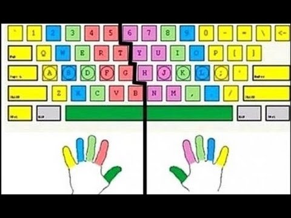

# Teclear en ordenador

Independientemente de la formación hay que hacer una especial mención al aprendizaje de técnicas de escritura con teclado.

Es muy importante aprender a teclear bien ya que se consigue:

* Mejora de la productividad
* Reducir riesgo de lesiones
* Mejora de la autoestima

Se recomiendan los siguientes enlaces para aprender y practicar.

* [TypingClub](https://www.typingclub.com/): Curso muy bueno gratuito.
