# Instalación de Virtual Box

## Introducción
Oracle VM VirtualBox, el software de virtualización multiplataforma de código abierto más popular del mundo, permite a los desarrolladores entregar código más rápido, ya que pueden ejecutar múltiples sistemas operativos en un solo dispositivo. Los equipos de TI y los proveedores de soluciones usan VirtualBox para reducir los costes operativos y acortar el tiempo necesario para implementar aplicaciones de forma segura on-premises y en la nube.

## Descarga

Hay que descargarse dos cosas:

* **Ejecutable de instalación de VirtualBox**. Es este caso para instalar en Windows.
https://download.virtualbox.org/virtualbox/7.1.0/VirtualBox-7.1.0-164728-Win.exe 
* **VirtualBox Extension Pack**. Permite integración entre la máquinma Host y las máquinas virtuales. Permite copiar y pegar, mejora la integración de teclados y ratones, etc. 
https://download.virtualbox.org/virtualbox/7.1.0/Oracle_VirtualBox_Extension_Pack-7.1.0.vbox-extpack

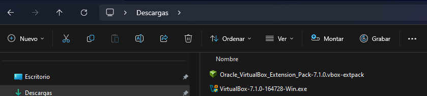

## Instalación de Virtual Box

Comenzamos ejecutando el instalador, VirtualBox-7.1.0-164728-Win.exe. Todo por defecto, (Nest --> Next, ..).

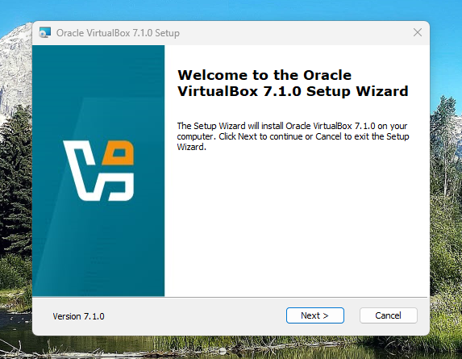

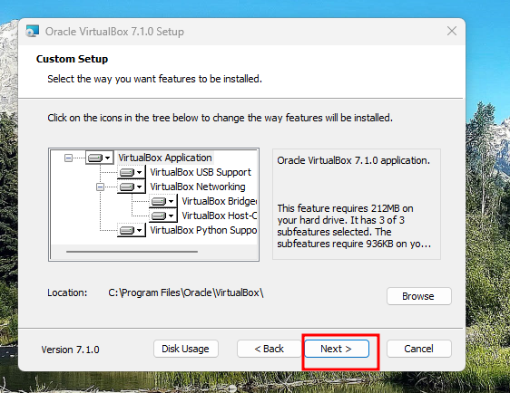

Nos avisa que se instalarán tarjetas de red virtuales y que temporalmente se desconectará la red.

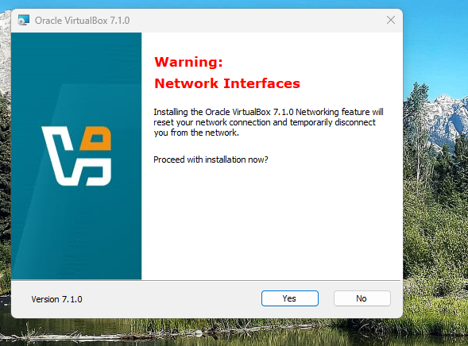

Nos informa de la instalación de dependencias de **Python**. Siempre Yes.

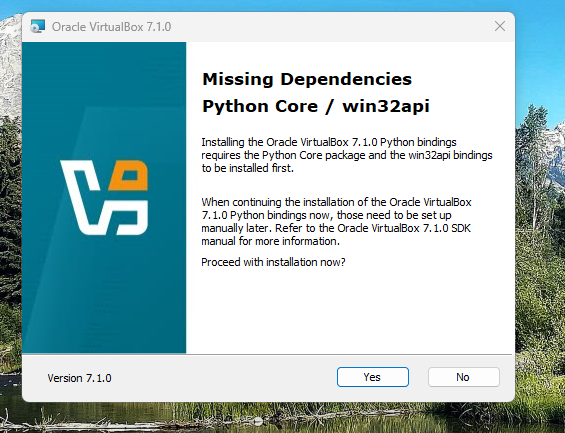

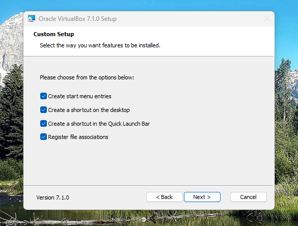

Por último **Install**.

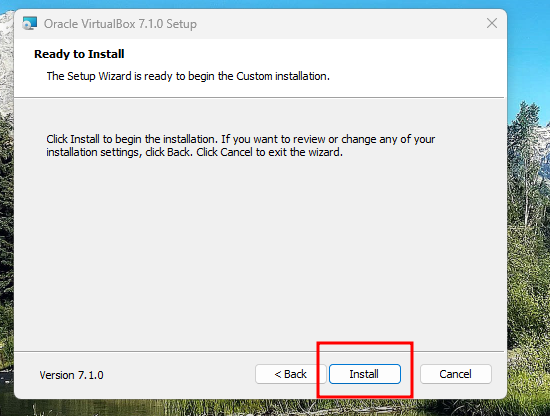

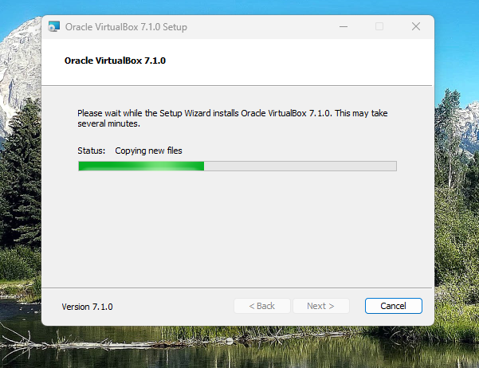

Dejamos que arranque despues de finalizar.

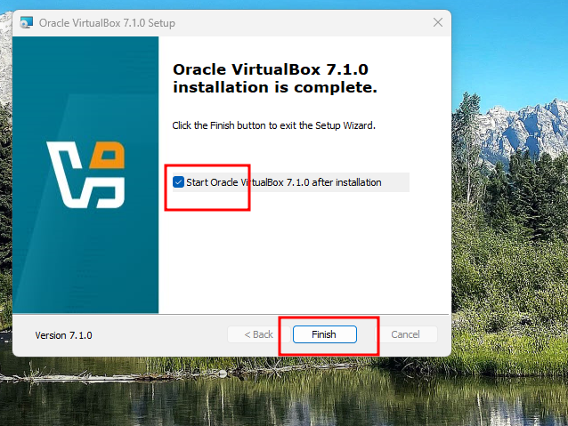

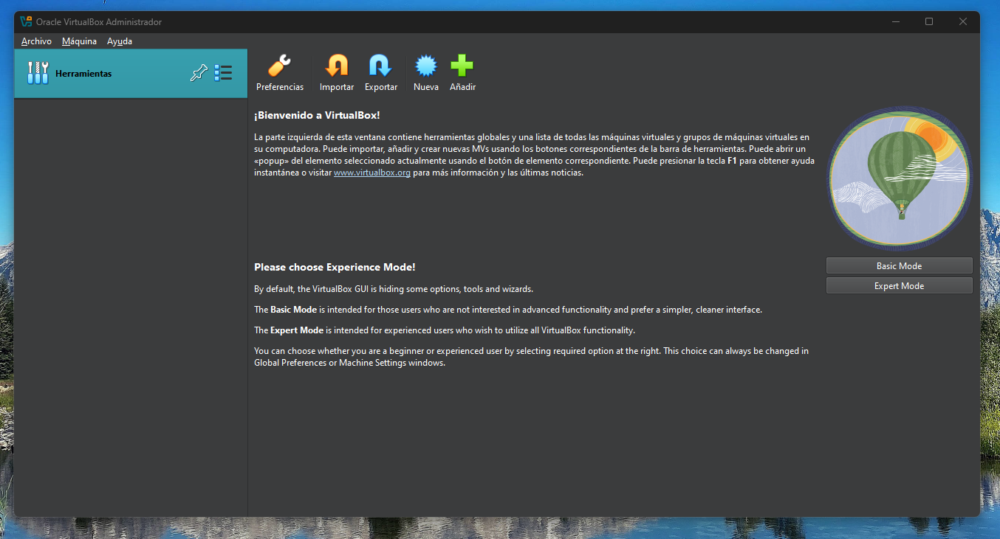

## Instalación del Extension Pack

Nos trasladamos al meú **Archivo --> Herramientas --> Administrador de paquete de Extensiones**. Tambien podemos pulsar **CTLR + T**. 

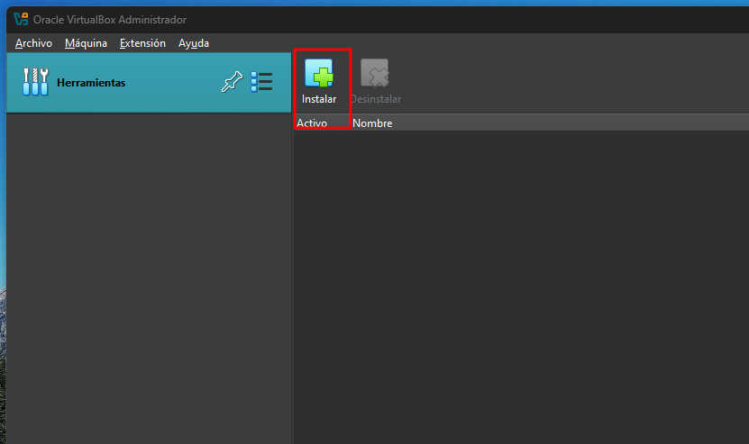

Pulsamos instalar y buscamos en descargas el fichero descargado **Oracle_VirtualBox_Extension_Pack-7.1.0.vbox-extpack**.

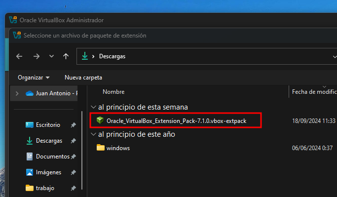

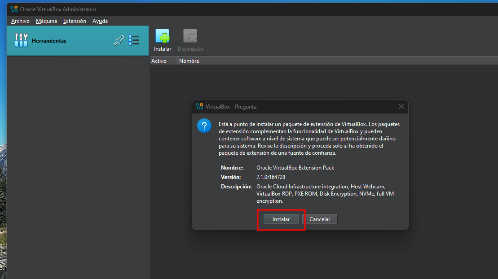

Pulsamos en Instalar. Bajamos la licencia hasta el final y pulsamos **Acepto**. Se instalará la extensión.

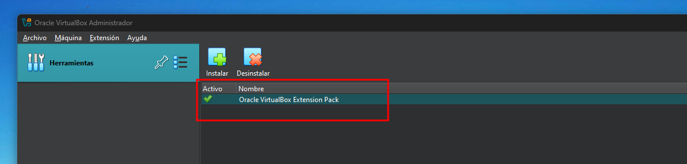

## Modo experto de VirtualBox

En la página de bienvenida seleccionar la opción **Expert Mode**.

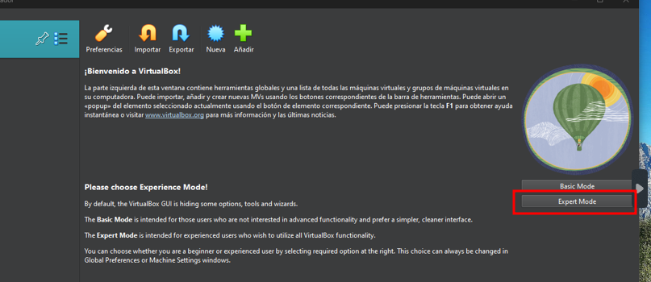

Esta opción es necesaria para ver el menu de redes.

## Redes en VirtualBox

Las redes se pueden ver en modo Experto bajo el menú **Archivo --> Herramientas --> Administrador de Red**. Hay que tener al menos una red NAT.

> ##### IMPORTANTE
>
> La revisión de redes la haremos con una clase.
{: .block-danger }

## Atajos en VirtualBox

En todos los programas de virtualización existe una tecla llamada **MASTER** que permite combinar con otras teclas para interactuar con el sistema anfitrión, nuestro windows.

La tecla master en VirtualBox es la tecla CONTROL DERECHA, (CTLR DER).

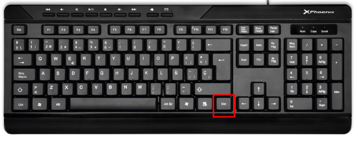

Enumeramos los atajos mas comunes dentro de una máquina virtual.

* **MASTER**: Escapar del entorno virtual. Accedemos al operativo principal.
* **MASTER + F**: Pantalla completa o normal. Alterna ambas.

